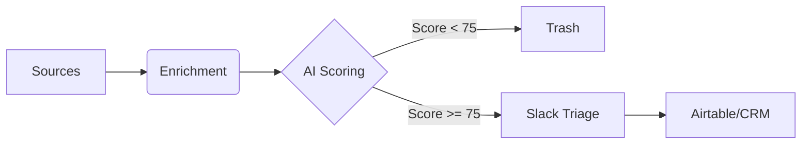

# 🎯 Enterprise AI Deal Flow System

Automated pipeline that sources, scores, and surfaces seed-stage enterprise AI startups from 10+ channels.

## 🚀 Quick Start

### 1. Install
```bash
# Clone the repo
git clone <your-repo-url>
cd dealflow

# Install dependencies (requires Python 3.9+)
pip install -e ".[dev]"
```

### 2. Configure
Create a `.env` file in the root directory:
```bash
cp .env.example .env
```
Edit `.env` with your API keys:
```env
# Required
GEMINI_API_KEY=...          # Google Gemini API Key for scoring
SLACK_WEBHOOK_URL=...       # Slack Webhook for notifications

# Slack Triage Server (Recommended)
SLACK_BOT_TOKEN=xoxb-...    # Bot User OAuth Token
SLACK_SIGNING_SECRET=...    # App Signing Secret

# Sourcing APIs (Optional but recommended)
GITHUB_TOKEN=...            # Higher rate limits for GitHub
APIFY_TOKEN=...             # Product Hunt, Reddit, Twitter
PHANTOMBUSTER_API_KEY=...   # LinkedIn
PHANTOMBUSTER_AGENT_ID=...  # LinkedIn Agent ID
```

### 3. Run
```bash
# Test the pipeline without posting to Slack
dealflow run --dry-run

# Run full pipeline
dealflow run

# Run specific source
dealflow run -s github -s arxiv
```

---

## 🏗 Architecture



**Pipeline Steps:**
1.  **Source**: Aggregates leads from GitHub, Product Hunt, YC, HuggingFace, arXiv, LinkedIn, Twitter, Reddit, Hacker News, RSS.
2.  **Deduplicate**: Merges duplicate startups based on name and URL.
3.  **Enrich**: Adds data from Website (Jina AI), GitHub Metrics, Crunchbase (Funding Check), Apollo (Founders).
4.  **Score**: Uses **Google Gemini 2.0 Flash** to score deals 0-100 based on a VC Analyst rubric.
5.  **Filter**: Discards deals with score < 75 or funding > $5M.
6.  **Notify**: Posts "High Signal" deals to Slack with interactive triage buttons.
7.  **Store**: Saves all data to SQLite (`data/deals.db`) and syncs high-priority deals to Airtable.

---

## 📡 Sourcing Channels

| Source | Description | Key Filters |
|--------|-------------|-------------|
| **GitHub** | Trending & Search | `enterprise`, `b2b`, `agent`, >100 stars, recent creation |
| **Product Hunt** | Daily Launches | `B2B`, `AI`, `automation`, `workflow`, >10 upvotes |
| **Y Combinator** | Company Directory | Tagged `AI` AND `B2B/Enterprise`, Live Product Check |
| **HuggingFace** | Models & Datasets | High-download models (>10k), Enterprise datasets |
| **arXiv** | Research Papers | Enterprise signals in Abstract, Top Labs (DeepMind, FAIR) mult-agent |
| **LinkedIn** | Search Export | "Founder" + "Stealth" + "ex-OpenAI/Stripe" (via Phantombuster) |
| **Twitter/X** | Launch Tweets | "launching", "joined YC", "stealth" (via Apify) |
| **Reddit** | Subreddits | `r/LocalLLaMA`, `r/MachineLearning` ("we built" posts) |
| **Hacker News** | Show HN | Enterprise/B2B keywords, >50 points |
| **RSS** | Tech News | Funding news, newsletters (Inc42, YourStory) |

---

## 🧠 AI Scoring Rubric

Deals are scored 0-100 by Gemini based on:

1.  **Problem Severity (30pts)**: Is this a "hair-on-fire" enterprise problem?
2.  **Differentiation (25pts)**: Novel tech/approach vs. thin GPT wrapper.
3.  **Team (25pts)**: Founder pedigree (PhD, Ex-FAANG, OSS contributions).
4.  **Market Readiness (20pts)**: Live product, traction, or strong pull.

**Thresholds:**
-   **High Priority (🔥)**: Score ≥ 85
-   **Worth Watching (📌)**: Score 75-84
-   **Pass (🗑️)**: Score < 75

---

## 🚨 Slack Triage Server

The system runs a **FastAPI server** to handle interactive buttons in Slack.

### Features
-   **Add to Pipeline**: Moves deal to "Reach Out" status.
-   **Pass**: Prompt for rejection reason (e.g., "Too early", "Competitive").
-   **Research**: Adds to reading list.

### Running the Server
1.  Expose the server to the internet (e.g., `ngrok http 3000`).
2.  Configure Slack App **Interactivity** and **Event Subscriptions** to your URL.
3.  Start server:
    ```bash
    python -m src.server
    ```

---

## 🛠 CLI Reference

| Command | Usage |
|---------|-------|
| `run` | `dealflow run [--source github] [--dry-run]` |
| `score` | `dealflow score --url <url>` |
| `digest` | `dealflow digest` (Weekly Summary) |
| `list` | `dealflow list --min-score 80` |
| `schedule` | `dealflow schedule --interval 6` |
| `crontab` | `dealflow crontab --launchd` |

---

## 🧪 Testing

Run user verification:
```bash
dealflow run --source github_search --dry-run
```

Run unit tests:
```bash
pytest tests/
```
