# **Enterprise AI Seed Deal Sourcing: Complete Automated System**

**Runtime**: Daily at 7:00 AM PT  
**Geography**: Full US + India coverage  
**Output**: 10-20 high-quality deals/day via Slack  
**Interface**: 100% Slack-native (mobile-optimized)

This system is a **comprehensive Python-based deal flow pipeline** that automates sourcing, enrichment, scoring, and triage of early-stage enterprise AI startups.

---

## **Table of Contents**

1. [System Architecture](#system-architecture)
2. [Phase 1: Multi-Channel Sourcing](#phase-1-sourcing)
3. [Phase 2: Enrichment Pipeline](#phase-2-enrichment)
4. [Phase 3: AI Scoring (Gemini 2.0)](#phase-3-ai-scoring)
5. [Phase 4: Slack Distribution](#phase-4-slack-distribution)
6. [Phase 5: Slack-Native Triage](#phase-5-triage)
7. [Phase 6: Outreach Automation](#phase-6-outreach)
8. [Setup Guide](#setup-guide)

---

## **System Architecture**

The system runs as a modular Python application (`dealflow`), orchestrating the following workflow:

```mermaid
graph LR
    subgraph Sourcing ["Phase 1: Multi-Channel Sourcing"]
        direction TB
        LIn[LinkedIn Sales Nav]
        GH[GitHub Trending]
        X[Twitter/X Launch]
        PH[Product Hunt]
        HN[Hacker News]
        R[Reddit]
        RSS[News/Blogs]
    end

    subgraph Processing ["Phase 2 & 3: Enrichment & Scoring"]
        direction TB
        Dedup(Deduplication)
        Enrich(Enrichment: Website + Funding)
        Score{Gemini AI Scoring}
    end

    subgraph Triage ["Phase 5: Slack Triage (Human Loop)"]
        Slack[#deal-flow-hot]
        Research[#deal-flow-research]
    end

    subgraph Actions ["Phase 6: Automated Actions"]
        Outreach[Draft Email & Queue]
        Read[Add to Reading List]
        Pass[Log Rejection Reason]
    end

    %% Flows
    LIn & GH & X & PH & HN & R & RSS --> Dedup
    Dedup --> Enrich
    Enrich --> Score

    %% Scoring Logic
    Score -->|Score < 60| Archive((Archive))
    Score -->|Score 60-74| Research
    Score -->|Score >= 75| Slack

    %% Slack Interactions
    Slack -- "Reaction: 📧" --> Outreach
    Slack -- "Reaction: 📚" --> Read
    Slack -- "Reaction: 👎" --> Pass
    
    style Score fill:#f96,stroke:#333,stroke-width:2px
    style Slack fill:#bbf,stroke:#333,stroke-width:2px
    style Outreach fill:#bfb,stroke:#333,stroke-width:2px
```



**Tech Stack**:
-   **Core**: Python 3.9+, FastAPI (Server), Click (CLI)
-   **AI**: Google Gemini 2.0 Flash (Scoring & Email Gen)
-   **Data**: SQLite (Local DB), Airtable (Sync)
-   **Scrapers**: Apify (Twitter/Reddit/PH), Phantombuster (LinkedIn), Algolia (HN)

---

## **Phase 1: Multi-Channel Sourcing**

The pipeline aggregates leads from 10+ high-signal channels (`src/sourcing/`).

### **A. LinkedIn Sales Navigator** (`-s linkedin`)
*Powered by Phantombuster*
-   **Target**: Founders coming out of stealth or leaving top AI labs.
-   **Queries**:
    1.  **Top-Tier Tech**: Ex-OpenAI/Google/Stripe + "Founder" + "Stealth"
    2.  **India Tech**: Ex-Zepto/Cred/Razorpay + "Founder" + "Building"
    3.  **Academic**: Stanford/IIT grads + "Co-Founder" + "AI/ML"

### **B. GitHub** (`-s github`, `-s github_search`)
*Powered by GitHub API*
-   **Trending**: Repos growing >500 stars/week.
-   **New Enterprise Repos**: `topic:enterprise-ai`, `topic:b2b-saas`, `topic:llm-orchestration`.
-   **Signals**: READMEs containing "SOC2", "SAML", "On-prem".

### **C. Twitter/X** (`-s twitter`)
*Powered by Apify*
-   **Launch**: "excited to announce" + "AI/Agent/Enterprise".
-   **Signal**: "joined YC", "coming out of stealth".
-   **Filters**: Min 20-50 faves depending on query type.

### **D. Product Hunt** (`-s product_hunt`)
*Powered by Apify*
-   **Filters**: B2B/AI category, >10 upvotes in first few hours.
-   **Keywords**: "automation", "workflow", "agent", "enterprise".

### **E. Hacker News** (`-s hacker_news`)
*Powered by Algolia API*
-   **Show HN**: Posts with "enterprise", "B2B", "LLM" in title.
-   **Validation**: Score > 50 points or > 20 comments.

### **F. Reddit** (`-s reddit`)
*Powered by Apify*
-   **Subreddits**: `r/MachineLearning`, `r/LocalLLaMA`, `r/SaaS`.
-   **Pattern**: "we built", "just launched", "feedback on".

### **G. Research / YC / News** (`-s arxiv`, `-s yc`, `-s rss`)
-   **Academic**: Papers from DeepMind/FAIR/Stanford on "Enterprise RAG", "Agentic Workflows".
-   **YC**: Batch directory filtered for "AI" + "B2B".
-   **RSS**: Inc42, YourStory, TLDR AI, The Batch, Ben's Bites.

---

## **Phase 2: Enrichment Pipeline**

Before scoring, deals are enriched to provide the AI with full context:
1.  **Website Parsing** (Jina AI): Extracts pricing, standard features, SOC2 compliance.
2.  **Crunchbase** (API): **CRITICAL FILTER** - If funding > $5M, the deal is auto-rejected (too late).
3.  **Founders** (Apollo/Hunter): Enriches founder profiles with past companies and emails.
4.  **GitHub Metrics**: Adds star velocity and issue counts for technical projects.

---

## **Phase 3: AI Scoring (Gemini 2.0)**

Deals are scored **0-100** using a specialized VC Analyst rubric (`src/scoring/scorer.py`).

**Rubric Dimensions:**
1.  **Problem Severity (30pts)**: Mission-critical vs. nice-to-have.
2.  **Differentiation (25pts)**: Proprietary IP vs. GPT wrapper.
3.  **Team (25pts)**: Founder pedigree (PhD, Ex-FAANG, Exits).
4.  **Market Readiness (20pts)**: Live product/traction vs. concept.

**Penalties**:
-   Geographic arbitrage without tech depth (-10)
-   Buzzword soup (-5)
-   Consumer pivot disguised as enterprise (-15)

**Thresholds**:
-   🔥 **High Priority (≥85)**: Immediate triage.
-   📌 **Watch (75-84)**: Good but maybe early/niche.
-   🗑️ **Pass (<75)**: Archived.

---

## **Phase 4: Slack Distribution**

The pipeline posts high-signal deals to Slack formatted for rapid decision making.

**Channel Structure**:
-   `#deal-flow-hot`: Score ≥ 75 (10-15 deals/day)
-   `#deal-flow-research`: Score 60-74 (Batch review)

**Message Content**:
-   **Header**: Startup Name + Score
-   **Facts**: Founder background, Funding stage, HQ.
-   **AI Analysis**: 3 key strengths, 1-2 red flags.
-   **Actions**: Interactive Triage Buttons.

---

## **Phase 5: Slack-Native Triage**

We run a **FastAPI Webhook Server** (`src/server.py`) to handle interactivity.

**Workflow**:
1.  **Interesting?** React with 📚.
    -   *Action*: Adds to **Reading List** in Airtable.
    -   *Bot*: "Added to reading list. (Total: 12 items)"
2.  **Pass?** React with 👎.
    -   *Action*: Bot posts ephemeral buttons: "Why?" (Wrapper, Too Early, No Moat).
    -   *Click*: Updates Airtable with reason.
3.  **Reach Out?** React with 📧.
    -   *Action*: AI generates a personalized cold email draft based on the analysis.
    -   *Bot*: Posts draft to thread with "Send Now" button.

---

## **Phase 6: Outreach Automation**

If you click "Send Now" or "Queue":
1.  **Drafting**: AI references specific "strengths" from the scorecard to personalize the intro.
2.  **Sending**: Uses Gmail API to send from your account.
3.  **Tracking**: Logs to `Outreach` table in Airtable.
4.  **Follow-up**: Auto-reminds you in Slack if no reply in 5 days.

---

## **Setup Guide**

### **1. Installation**
```bash
git clone https://github.com/tashasho/dealflow.git
cd dealflow
python3 -m venv .venv
source .venv/bin/activate
pip install -r requirements.txt
```

### **2. Configuration (.env)**
```env
# Core
GEMINI_API_KEY=...
SLACK_WEBHOOK_URL=...

# Triage Server
SLACK_BOT_TOKEN=...
SLACK_SIGNING_SECRET=...

# Sourcing
GITHUB_TOKEN=...
APIFY_TOKEN=...
PHANTOMBUSTER_API_KEY=...
```

### **3. Run Triage Server**
Expose port 3000 (ugrok) and run:
```bash
python -m src.server
```

### **4. Run Pipeline**
```bash
# Full daily run
python -m src.cli run

# Test specific source
python -m src.cli run --source github_search --dry-run
```

### **5. Scheduling**
Automate with cron (runs every 6 hours):
```bash
python -m src.cli crontab
```
